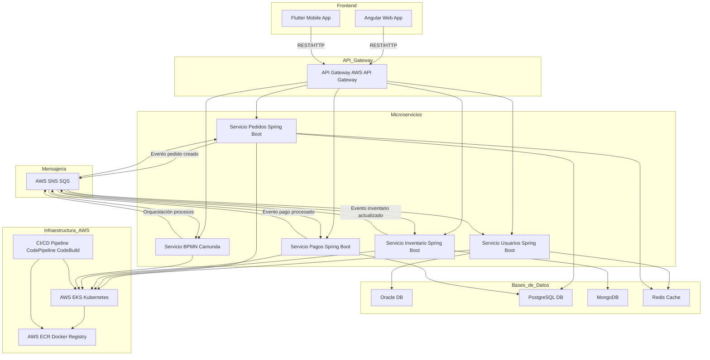
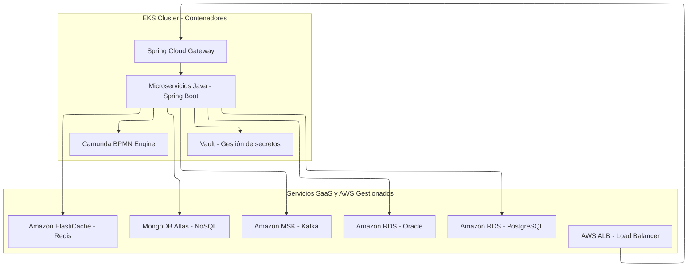
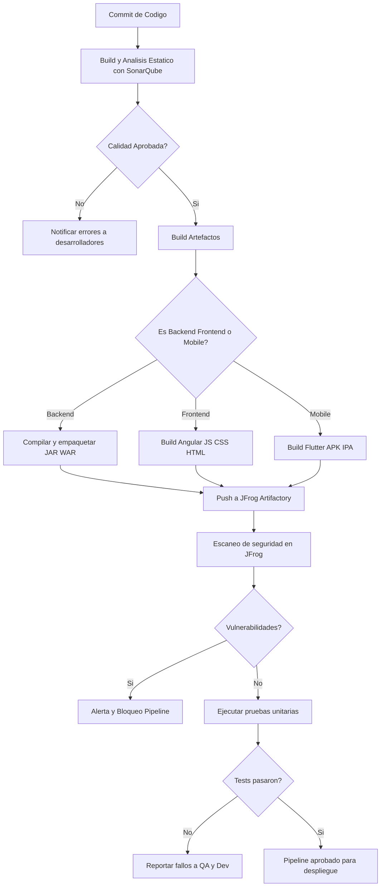
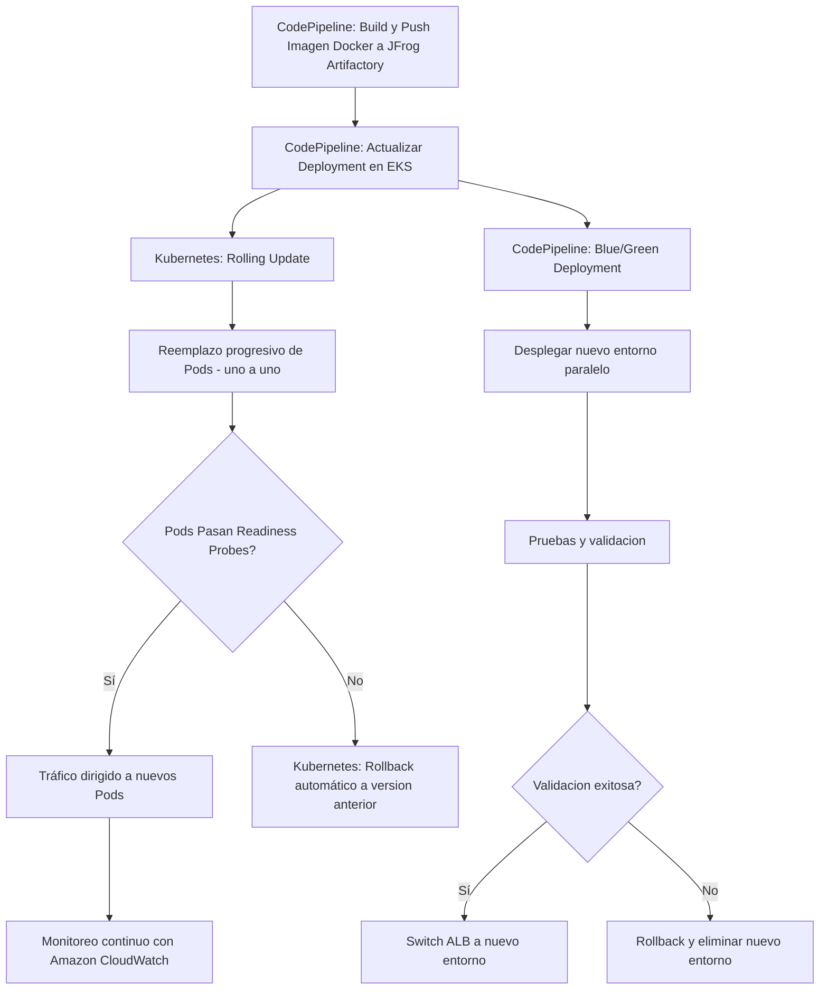
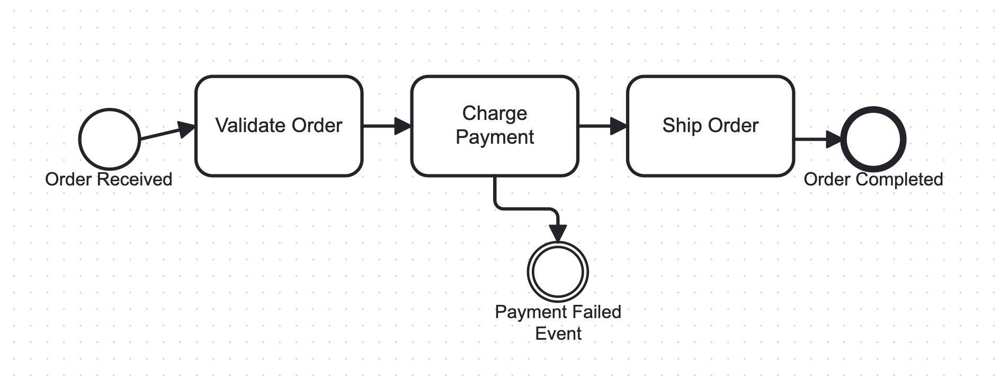

# SOLUCIÓN

## Supuestos Clave para la Propuesta
- Plataforma eCommerce con volumen medio-alto de transacciones, que requiere alta escalabilidad, baja latencia y alta disponibilidad.
- Infraestructura principal en AWS, integrada con sistemas on-premise existentes.
- Arquitectura basada en microservicios desacoplados para facilitar mantenimiento y escalabilidad.
- Manejo de datos estructurados y semiestructurados con diferentes necesidades de persistencia.
- Uso de un motor para orquestar procesos de negocio BPNM.
- Desarrollo ágil con despliegues automatizados para asegurar calidad y rapidez.
- Experiencia de usuario coherente entre web y móvil.

## Diseño de Arquitectura (Diagramas y Descripción):

### Consideraciones pera cada Microservicio - BACKEND

Se utilizará los siguientes patrones: 

Hexagonal Architecture, para desacoplar la lógica de negocio de tecnologías externas, facilitando pruebas, mantenibilidad y evolución del servicio. Hexagonal sobre Clean nos permite una implementación mas agil y menos estricta, ademas de tener en cuenta que tendremos un servicio de orquestación y la logica de flujo compleja ira sobre dicha herramienta.

CQRS: Para mejorar el rendimiento y la escalabilidad en e-commerce cuando se eleve el nivel de transaccionalidad, separando modelos de lectura y escritura.

Patrones de Resiliencia (Circuit Breaker, Retry, Timeout, Fallback): Para prevenir el colapso en cascada de microservicios dependientes. Especialmente críticos en flujos de checkout, pago o inventario. (Ver patrones de Orquestación y resilencia)

### Diagrama de Arquitectura 

### Comunicaciones

Sincrónica: El frontend (Angular y Flutter) se comunica con los microservicios a través del API Gateway, que enruta peticiones REST con autenticación y autorización centralizada en el mismo Gateway.

Asincrónica: Se usa AWS SQS para eventos de negocio que requieren desacople temporal o que se ejecutan en segundo plano (ejemplo: orden creada, stock actualizado, pago confirmado). Esto mejora escalabilidad y resiliencia.

### Persistencia de Datos
- Oracle: Alta consistencia y transaccionalidad para datos críticos (usuarios, pagos).
- PostgreSQL: Para datos transaccionales secundarios (pedidos), considerando buena escalabilidad horizontal.
- MongoDB: Para datos no relacionales, como catálogo de productos con esquemas flexibles y rápido acceso (lectura/escritura).
- Redis: Cache en memoria para acelerar consultas frecuentes, gestionar sesiones, contadores, carrito de compras.

## Patrones de Orquestación y Resiliencia:

- Orquestación con BPMN (Camunda): Para manejar flujos de negocio complejos (pedidos, pagos, inventarios) donde garantizamos control del flujo y manejo de errores.

- Orquestación con SAGA - Coreografía : Para tareas simples, eventos asíncronos y notificaciones

- Circuit breakers (Resilience4j): Para la comunicaciónes directas entre microservicios.

- Otros patrones a considerar:
    - Retry  
    - Timeout  
    - Fallback  
    - Rate Limiting  
    - Load Balancer  
    - Health Checks  
    - Caching

## Infraestructura y CI/CD:

### Diagrama de Infraestructura

#### Integración híbrida (AWS - On-premise):
VPN/Direct Connect asegura baja latencia y seguridad en comunicación con sistemas existentes, importante para migración y coexistencia.

#### Flujo CI

### Estrategia de Deployment 
Se adopta **Rolling Update** como estrategia principal en Amazon EKS, ya que permite la actualización progresiva de pods sin generar interrupciones en el servicio y lograr el mayor uptime.

Para cambios críticos, se considera **Blue/Green Deployment**, habilitando la creación de entornos paralelos y la conmutación controlada mediante AWS Application Load Balancer (ALB), permitiendo validación previa antes de redirigir tráfico.

Ambas estrategias se respaldan con **Readiness Probes**, que aseguran que solo los pods listos reciban tráfico, y con mecanismos de rollback automático en caso de fallos.

El **monitoreo del despliegue** se realiza con **Amazon CloudWatch**, centralizando métricas y logs para una supervisión continua y efectiva del estado del sistema.

#### Flujo CD

## Plan de Pruebas y Calidad:
- QA Automatizado: Usamos Cypress, para frontend web, en lugar de Selenium por su integración nativa y rapidez, y Appium para pruebas móviles Flutter.

- QA Manual (basado en ISTQB): Incluye pruebas exploratorias, basadas en casos, usabilidad, regresión y ad-hoc para cubrir escenarios complejos y experiencia de usuario no automatizable, con trazabilidad en Jira.

- Unitarias: Estas pruebas automatizadas se ejecutan en batch tras cada build dentro del pipeline CI.

## Desarrollo Frontend y Mobile:

### Integración con Microservicios 

- Angular y Flutter consumirán APIs RESTful de los microservicios backend usando JSON y autenticación con tokens JWT.

- Se implementará desarrollo por contrato usando OpenAPI (Swagger) para definir los contratos API antes del desarrollo, asegurando alineación entre backend y frontend. Además, se usarán mock APIs generadas a partir de OpenAPI para que frontend pueda desarrollar y probar en paralelo con backend.

### Coherencia de interfaces

- Para asegurar coherencia visual y de experiencia, se definirá un design system común usando Figma, que documente colores, tipografías, iconos y patrones UX.

## Implementación del BPMN Engine:
- 	Seleccionar un BPMN engine (por ejemplo, Camunda o Activiti) e integrarlo en la arquitectura.
- 	Diseñar un proceso de negocio clave usando BPMN y describir cómo se implementará y ejecutará.
- 	Explicar cómo se monitorizarán y optimizarán los procesos de negocio.

- Se selecciona Camunda por que es una solucion escalable y robusta, ademas, ofrece interfaz grafica para diseño y monitoreo de flujos, integracion con microservicios, integración con AWS SQS .

- El siguiente flujo tiene los siguientes pasos: 

    - Orquesta los microservicios: Validación, Cobro y Envío.
    - Usa un Event en la tarea de cobro para simular fallo (p.ej., timeout pago).
    - En caso de fallo, ejecuta un rollback para cancelar el pedido.
    - El rollback se puede implementar como llamada a un microservicio compensatorio que revierta acciones previas.

- El monitoreo se integra con AWS CloudWatch para seguimiento y alertas de fallos o cuellos de botella.

## Buenas Prácticas:

Stack tecnológico:

- Backend: Java (Spring Boot, Spring Cloud, Feign, Maven, Camunda, JUnit, Mockito)
- Frontend web: Angular + TypeScript, Cypress
- Frontend móvil: Flutter
- Bases de datos: Oracle, PostgreSQL, MongoDB, Redis
- Contenedores y orquestación: Docker, AWS EKS (con gestión de secrets)
- CI/CD: AWS Pipelines, JFrog Artifactory
- Distribución: CDN
- Calidad: SonarQube (con Quality Gates), SonarLint
- Resiliencia: Resilience4j
- Monitoreo: OpenTelemetry, AWS CloudWatch
- Seguridad: OWASP, JFrog Vulnerabilities

Buenas Prácticas para el Equipo de Desarrollo

- Uso de **Scrum** para gestión ágil de proyectos, con ciclos cortos.
- Aplicar principios de **Clean Code**, **SOLID**, **KISS**, **DRY** para mantener código legible, mantenible y escalable.
- Implementación de proceso de **DevSecOpS**.
- Implementar **Trunk-Based Development** para integración temprana y continua.
- Uso de herramientas de análisis estático y control de calidad: **SonarLint**, **SonarQube**, y escaneo de vulnerabilidades con **JFrog Xray**.
- Documentación y revisión constante del código para fomentar el conocimiento compartido y la mejora continua, mediante PRs de doble revisores.
- Seguir estándares de seguridad recomendados por **OWASP** para proteger la aplicación.
